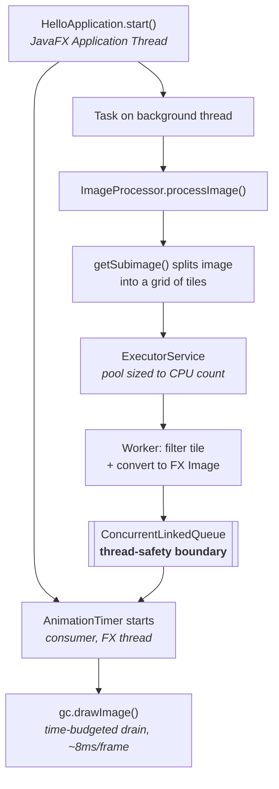

# ImageProcessorApp

A JavaFX application that applies image filters by splitting an image into a grid of tiles,
filtering the tiles in parallel across a thread pool, and rendering each tile to a canvas as
soon as it finishes — so the image visibly fills in while processing runs and the UI stays
responsive throughout.

Built as a study of **JavaFX threading and producer/consumer concurrency**: the interesting
problem here is not the greyscale maths, it's getting work off the UI thread and results back
onto it without blocking, tearing, or over-threading.

**Stack:** Java 21 · JavaFX 21 · Maven

> 📄 **[Concurrency Design Notes](docs/CONCURRENCY.md)** — a detailed write-up of the thread
> model, the three concurrency bugs found and fixed in this codebase (a blocked UI thread, a
> dead guard flag causing unbounded thread creation, and a singleton that wasn't one), and the
> issues that remain open.

---

## How it works



The design rests on one rule: **JavaFX `Canvas` and `GraphicsContext` may only be touched on
the JavaFX Application Thread.** So worker threads never touch them. They publish finished tiles
into a concurrent queue and walk away; an `AnimationTimer` — which already runs on the FX thread
— drains that queue each frame and draws. The queue is the boundary between the two worlds.

### Design decisions worth noting

**Processing runs off the UI thread.** `processImage()` blocks until every tile is done, so it
is dispatched via a `javafx.concurrent.Task` on a background thread. Calling it directly from
`start()` would block the FX event loop, which would stop the `AnimationTimer` from ever firing —
the UI would freeze and every tile would appear at once at the end, defeating the whole point.

**The expensive conversion happens on the worker, not the UI thread.**
`SwingFXUtils.toFXImage()` copies every pixel, so it runs inside the worker task where the
parallelism is. The FX thread is left with nothing but `drawImage()`.

**The consumer drains on a time budget.** `AnimationTimer.handle()` draws queued tiles for at
most ~8ms of each ~16.6ms frame. Draining the entire backlog in one call would block the FX
thread all over again, just at a smaller scale.

**The pool is sized to the hardware.** Filtering is pure CPU work with no blocking I/O, so the
useful degree of parallelism is bounded by core count — `Runtime.getRuntime().availableProcessors()`.
Extra threads beyond that add context-switching and stack memory without adding throughput.

**Filters must be pure.** `getSubimage()` aliases the parent image's `DataBuffer` rather than
copying it, so every tile shares one raster across all worker threads. Concurrent reads are safe
only because no filter ever writes to its input. Any new `ImageFilter` must allocate and return a
fresh output image.

Each of these decisions — and the bugs that motivated them — is explained in full in the
[Concurrency Design Notes](docs/CONCURRENCY.md).

---

## Project structure

```text
src/main/java/com/image/imageprocessing/
├── filter/                       # ImageFilter interface + GreyScaleFilter
├── image/                        # ImageData (tile + coords), DrawMultipleImagesOnCanvas (consumer)
├── io/                           # ImageReadInf interface + FileImageIO
├── processor/                    # ImageProcessor — tiling, thread pool, task submission
└── HelloApplication.java         # Entry point

src/main/resources/com/image/imageprocessing/io/
└── test.jpg                      # Bundled sample image
```

The application is a JPMS module (`com.image.imageprocessing`). Only the root and `image`
packages are exported; `filter`, `io`, and `processor` are internal to the module.

---

## Prerequisites

- **JDK 21** or higher (ensure `JAVA_HOME` is set)
- Maven 3.x, or the included Maven wrapper (`mvnw` / `mvnw.cmd`)

## Running it

**Windows (PowerShell / CMD):**

```powershell
.\mvnw.cmd clean compile
.\mvnw.cmd javafx:run
```

**macOS / Linux:**

```bash
./mvnw clean compile
./mvnw javafx:run
```

**From an IDE (IntelliJ IDEA / VS Code):** import the directory as a Maven project, set the
project SDK to JDK 21, and run `com.image.imageprocessing.HelloApplication`.

A window opens with the sample image and four controls:

| Control | Threads | Runs on | What it shows |
|---|---|---|---|
| **Run Async** | pool (= CPU count) | background | normal operation |
| **Run Sync** | 1 | background | single-threaded baseline |
| **Run Sync on FX thread** | 1 | **FX thread** | the window freezes until it finishes |
| **Benchmark both** | both | background | warmed, repeated measurement |

Sync and Async both run *off* the FX thread, so the only variable between them is
parallelism — that comparison is a fair speedup number. The third button deliberately
violates the rule, to show what blocking the UI thread looks like.

### Benchmarking

```powershell
.\mvnw.cmd javafx:run "-Dapp.benchmark=true"
```

This runs the comparison at startup and prints it to stdout. It discards warm-up rounds and
reports a distribution, because a single timing on a cold JVM measures the JIT compiler as
much as the code — the first run of either mode is roughly twice as slow as a warm one.

### Choosing the image and tile size

```powershell
.\mvnw.cmd javafx:run "-Dapp.image=/com/image/imageprocessing/io/test-odd.jpg" "-Dapp.tile=100"
```

`app.image` is a resource path on the module path and `app.tile` is the tile size in pixels.
Two samples are bundled: `test.jpg` (1920×1080) and `test-odd.jpg` (1023×769).

The second exists to exercise edge tiles. 1023 and 769 are not multiples of any round tile
size, so at tile size 100 the grid is 11 × 8, with a final column 23px wide and a final row
69px tall. The tile dimensions are clamped to the image bounds, so those partial tiles are
filtered and drawn like any other and the output is complete to the edge.

#### What that guards against

The tiling grid was originally sized with plain integer division, which silently discarded the
remainder along the right and bottom edges. Both renders below are the same source at tile size
100. Magenta marks pixels that no tile ever covered — on the live canvas they are simply never
drawn, so they stay blank.

| Integer division — 10 × 7 grid | `ceilDiv` + clamped tiles — 11 × 8 grid |
|---|---|
|  |  |
| 70 tiles, covering 1000×700 of a 1023×769 image | 88 tiles, covering all of it |

The dropped strip can never be wider than `tileSize - 1`, so at the default tile size of 10 the
loss is under 10px — which is why a coarse tile is used here to make it legible. Worth noting
that the parallel execution was equally correct in both cases: it distributed 70 tiles reliably
in the first and 88 in the second. Correct concurrency does not imply a correct result.

Quote the `-D` arguments in PowerShell. Unquoted, `-Dapp.tile=100` is mangled and Maven
reports `Unknown lifecycle phase`.

Sample result on 8 logical cores, 1920×1080 source, tile size 10 (20,736 tiles):

```
=== Benchmark: 3 warm-up + 5 measured runs per mode ===
Synchronous (single thread)   1 thread   min  277.1  median  376.6  mean  384.1 ms
Asynchronous (thread pool)    8 threads  min   97.1  median  172.1  mean  160.3 ms
Speedup (median): 2.19x on 8 cores
```

Parallelism gives a real ~2–3× improvement, but well short of 8×. The remaining headroom is
limited by the workload rather than the threading: 20,736 tasks of 100 pixels each is very
fine granularity, and `GreyScaleFilter` allocates a `Color` object per pixel, making the run
allocation-bound. Both are on the roadmap. The reasoning is worked through in the
[Concurrency Design Notes](docs/CONCURRENCY.md).

---

## Adding a filter

Implement the single-method interface and pass it to the processor:

```java
public class SepiaFilter implements ImageFilter {
    @Override
    public BufferedImage filter(BufferedImage source) {
        // Must not modify `source` — allocate and return a new image.
        BufferedImage out = new BufferedImage(
                source.getWidth(), source.getHeight(), BufferedImage.TYPE_INT_RGB);
        // ...
        return out;
    }
}
```

---

## Current limitations

Known and intentional, listed here so the scope is honest:

- **Fine tile granularity is inefficient.** The default tile size of 10px produces tens of
  thousands of very small tasks, where scheduling overhead is significant relative to the work.
- **`GreyScaleFilter` is not optimised.** It uses per-pixel `getRGB`/`setRGB`, which routes
  through the `ColorModel` and is considerably slower than direct raster access.
- **The queue is unbounded** — there is no backpressure if the producer outruns the consumer.
- **No test suite yet.** JUnit 5 is declared as a dependency but `src/test` does not exist.

## Roadmap

- [x] Synchronous single-threaded mode, for a like-for-like performance baseline
- [x] Correct edge-tile handling for arbitrary image dimensions
- [ ] File chooser / CLI arguments instead of a bundled sample image
- [ ] Write filtered output to disk (`ImageReadInf.sendImage` is currently a stub)
- [ ] Additional filters — blur, sharpen, sepia
- [ ] Raster-based fast path for `GreyScaleFilter`
- [ ] Unit tests, including a concurrency test over a shared source image

## License

Not currently licensed. All rights reserved by the author.
