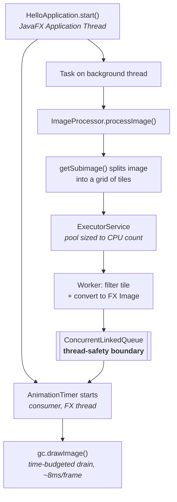

# ImageProcessorApp

A JavaFX application that applies image filters by splitting an image into a grid of tiles,
filtering the tiles in parallel across a thread pool, and rendering each tile to a canvas as
soon as it finishes — so the image visibly fills in while processing runs and the UI stays
responsive throughout.

Built as a study of **JavaFX threading and producer/consumer concurrency**: the interesting
problem here is not the greyscale maths, it's getting work off the UI thread and results back
onto it without blocking, tearing, or over-threading.

**Stack:** Java 21 · JavaFX 21 · Maven

> 📄 **[Concurrency Design Notes](docs/CONCURRENCY.md)** — a detailed write-up of the thread
> model, the three concurrency bugs found and fixed in this codebase (a blocked UI thread, a
> dead guard flag causing unbounded thread creation, and a singleton that wasn't one), and the
> issues that remain open.

---

## How it works



The design rests on one rule: **JavaFX `Canvas` and `GraphicsContext` may only be touched on
the JavaFX Application Thread.** So worker threads never touch them. They publish finished tiles
into a concurrent queue and walk away; an `AnimationTimer` — which already runs on the FX thread
— drains that queue each frame and draws. The queue is the boundary between the two worlds.

### Design decisions worth noting

**Processing runs off the UI thread.** `processImage()` blocks until every tile is done, so it
is dispatched via a `javafx.concurrent.Task` on a background thread. Calling it directly from
`start()` would block the FX event loop, which would stop the `AnimationTimer` from ever firing —
the UI would freeze and every tile would appear at once at the end, defeating the whole point.

**The expensive conversion happens on the worker, not the UI thread.**
`SwingFXUtils.toFXImage()` copies every pixel, so it runs inside the worker task where the
parallelism is. The FX thread is left with nothing but `drawImage()`.

**The consumer drains on a time budget.** `AnimationTimer.handle()` draws queued tiles for at
most ~8ms of each ~16.6ms frame. Draining the entire backlog in one call would block the FX
thread all over again, just at a smaller scale.

**The pool is sized to the hardware.** Filtering is pure CPU work with no blocking I/O, so the
useful degree of parallelism is bounded by core count — `Runtime.getRuntime().availableProcessors()`.
Extra threads beyond that add context-switching and stack memory without adding throughput.

**Filters must be pure.** `getSubimage()` aliases the parent image's `DataBuffer` rather than
copying it, so every tile shares one raster across all worker threads. Concurrent reads are safe
only because no filter ever writes to its input. Any new `ImageFilter` must allocate and return a
fresh output image.

Each of these decisions — and the bugs that motivated them — is explained in full in the
[Concurrency Design Notes](docs/CONCURRENCY.md).

---

## Project structure

```text
src/main/java/com/image/imageprocessing/
├── filter/                       # ImageFilter interface + GreyScaleFilter
├── image/                        # ImageData (tile + coords), DrawMultipleImagesOnCanvas (consumer)
├── io/                           # ImageReadInf interface + FileImageIO
├── processor/                    # ImageProcessor — tiling, thread pool, task submission
└── HelloApplication.java         # Entry point

src/main/resources/com/image/imageprocessing/io/
└── test.jpg                      # Bundled sample image
```

The application is a JPMS module (`com.image.imageprocessing`). Only the root and `image`
packages are exported; `filter`, `io`, and `processor` are internal to the module.

---

## Prerequisites

- **JDK 21** or higher (ensure `JAVA_HOME` is set)
- Maven 3.x, or the included Maven wrapper (`mvnw` / `mvnw.cmd`)

## Running it

**Windows (PowerShell / CMD):**

```powershell
.\mvnw.cmd clean compile
.\mvnw.cmd javafx:run
```

**macOS / Linux:**

```bash
./mvnw clean compile
./mvnw javafx:run
```

**From an IDE (IntelliJ IDEA / VS Code):** import the directory as a Maven project, set the
project SDK to JDK 21, and run `com.image.imageprocessing.HelloApplication`.

A window opens showing the bundled sample image rendered in greyscale, and the elapsed
processing time is printed to the console on completion.

---

## Adding a filter

Implement the single-method interface and pass it to the processor:

```java
public class SepiaFilter implements ImageFilter {
    @Override
    public BufferedImage filter(BufferedImage source) {
        // Must not modify `source` — allocate and return a new image.
        BufferedImage out = new BufferedImage(
                source.getWidth(), source.getHeight(), BufferedImage.TYPE_INT_RGB);
        // ...
        return out;
    }
}
```

---

## Current limitations

Known and intentional, listed here so the scope is honest:

- **Tile size must divide both image dimensions evenly.** Loop bounds use integer division, so
  remainder pixels along the right and bottom edges are not processed or drawn.
- **Fine tile granularity is inefficient.** The default tile size of 10px produces tens of
  thousands of very small tasks, where scheduling overhead is significant relative to the work.
- **`GreyScaleFilter` is not optimised.** It uses per-pixel `getRGB`/`setRGB`, which routes
  through the `ColorModel` and is considerably slower than direct raster access.
- **The queue is unbounded** — there is no backpressure if the producer outruns the consumer.
- **Canvas size is fixed** at 1920×1080 rather than being sized to the loaded image.
- **No test suite yet.** JUnit 5 is declared as a dependency but `src/test` does not exist.

## Roadmap

- [ ] Synchronous single-threaded mode, for a like-for-like performance baseline
- [ ] File chooser / CLI arguments instead of a bundled sample image
- [ ] Correct edge-tile handling for arbitrary image dimensions
- [ ] Write filtered output to disk (`ImageReadInf.sendImage` is currently a stub)
- [ ] Additional filters — blur, sharpen, sepia
- [ ] Raster-based fast path for `GreyScaleFilter`
- [ ] Unit tests, including a concurrency test over a shared source image

## License

Not currently licensed. All rights reserved by the author.
