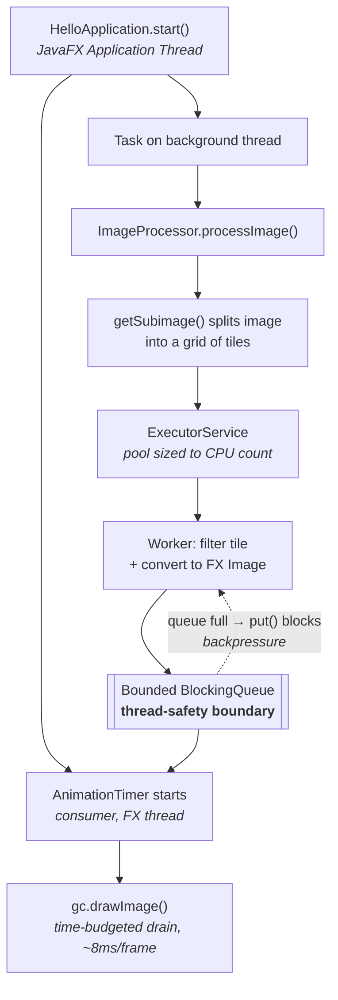

# ImageProcessorApp

A JavaFX application that applies image filters by splitting an image into a grid of tiles,
filtering the tiles in parallel across a thread pool, and rendering each tile to a canvas as
soon as it finishes — so the image visibly fills in while processing runs and the UI stays
responsive throughout.

Built as a study of **JavaFX threading and producer/consumer concurrency**: the interesting
problem here is not the greyscale maths, it's getting work off the UI thread and results back
onto it without blocking, tearing, or over-threading.

**Stack:** Java 21 · JavaFX 21 · Maven

> 📄 **[Concurrency Design Notes](docs/CONCURRENCY.md)** — a detailed write-up of the thread
> model, the three concurrency bugs found and fixed in this codebase (a blocked UI thread, a
> dead guard flag causing unbounded thread creation, and a singleton that wasn't one), and the
> issues that remain open.

---

## How it works



The design rests on one rule: **JavaFX `Canvas` and `GraphicsContext` may only be touched on
the JavaFX Application Thread.** So worker threads never touch them. They publish finished tiles
into a concurrent queue and walk away; an `AnimationTimer` — which already runs on the FX thread
— drains that queue each frame and draws. The queue is the boundary between the two worlds.

### Design decisions worth noting

**Processing runs off the UI thread.** `processImage()` blocks until every tile is done, so it
is dispatched via a `javafx.concurrent.Task` on a background thread. Calling it directly from
`start()` would block the FX event loop, which would stop the `AnimationTimer` from ever firing —
the UI would freeze and every tile would appear at once at the end, defeating the whole point.

**The expensive conversion happens on the worker, not the UI thread.**
`SwingFXUtils.toFXImage()` copies every pixel, so it runs inside the worker task where the
parallelism is. The FX thread is left with nothing but `drawImage()`.

**The consumer drains on a time budget.** `AnimationTimer.handle()` draws queued tiles for at
most ~8ms of each ~16.6ms frame. Draining the entire backlog in one call would block the FX
thread all over again, just at a smaller scale.

**The pool is sized to the hardware.** Filtering is pure CPU work with no blocking I/O, so the
useful degree of parallelism is bounded by core count — `Runtime.getRuntime().availableProcessors()`.
Extra threads beyond that add context-switching and stack memory without adding throughput.

**The queue is bounded, and blocking is asymmetric.** Producers `put()`, so a worker that
outruns the consumer blocks until space appears — that is backpressure: the consumer's rate
propagates back to the producers instead of being absorbed by an ever-growing heap. The
consumer `poll()`s and never blocks, because the consumer is the UI thread and blocking it is
the one thing this design exists to avoid. Which side may block is the whole point.

**The engine does not know the UI exists.** `ImageProcessor` publishes through a `TileSink`
interface, not to the canvas class. The same code path drives the live UI, the benchmark
(which counts tiles instead of drawing them, so the consumer can never be the bottleneck), and
the test suite (which records them). Without that seam the processor would be untestable —
the canvas sink calls `SwingFXUtils.toFXImage`, which needs a running JavaFX toolkit.

**Filters must be pure.** `getSubimage()` aliases the parent image's `DataBuffer` rather than
copying it, so every tile shares one raster across all worker threads. Concurrent reads are safe
only because no filter ever writes to its input. Any new `ImageFilter` must allocate and return a
fresh output image. `SyncAsyncEquivalenceTest` is what fails if that contract is ever broken.

Each of these decisions — and the bugs that motivated them — is explained in full in the
[Concurrency Design Notes](docs/CONCURRENCY.md).

---

## Project structure

```text
src/main/java/com/image/imageprocessing/
├── filter/                       # ImageFilter interface + GreyScaleFilter
├── image/                        # TileSink (the producer/consumer seam), ImageData,
│                                 #   DrawMultipleImagesOnCanvas (the UI consumer)
├── io/                           # ImageReadInf interface + FileImageIO
├── processor/                    # ImageProcessor — tiling, thread pool, task submission
└── HelloApplication.java         # Entry point

src/test/java/com/image/imageprocessing/
├── filter/                       # GreyScaleFilterTest
├── processor/                    # TileCoverageTest, SyncAsyncEquivalenceTest
└── support/                      # RecordingSink, TestImages

src/main/resources/com/image/imageprocessing/io/
├── test.jpg                      # Bundled sample image (1920×1080)
└── test-odd.jpg                  # 1023×769, for exercising edge tiles
```

The application is a JPMS module (`com.image.imageprocessing`). Only the root and `image`
packages are exported; `filter`, `io`, and `processor` are internal to the module.

---

## Prerequisites

- **JDK 21** or higher (ensure `JAVA_HOME` is set)
- Maven 3.x, or the included Maven wrapper (`mvnw` / `mvnw.cmd`)

## Running it

**Windows (PowerShell / CMD):**

```powershell
.\mvnw.cmd clean compile
.\mvnw.cmd javafx:run
```

**macOS / Linux:**

```bash
./mvnw clean compile
./mvnw javafx:run
```

**From an IDE (IntelliJ IDEA / VS Code):** import the directory as a Maven project, set the
project SDK to JDK 21, and run `com.image.imageprocessing.HelloApplication`.

A window opens with the sample image and four controls:

| Control | Threads | Runs on | What it shows |
|---|---|---|---|
| **Run Async** | pool (= CPU count) | background | normal operation |
| **Run Sync** | 1 | background | single-threaded baseline |
| **Run Sync on FX thread** | 1 | **FX thread** | the window freezes, then deadlocks |
| **Benchmark both** | both | background | warmed, repeated measurement |

Sync and Async both run *off* the FX thread, so the only variable between them is
parallelism — that comparison is a fair speedup number. The third button deliberately
violates the rule.

### Two different failures, from one wrong decision

The third button is worth its own note, because running the pipeline on the UI thread breaks
it twice over, in ways that are commonly conflated:

- **Starvation.** The FX thread is busy inside the processing loop, so the `AnimationTimer`
  never fires and nothing is painted until the work finishes. The window is unresponsive, but
  the run *does* complete — it is a liveness problem, not a stuck one.
- **Deadlock.** Once the bounded queue fills, the FX thread blocks trying to publish a tile —
  and it is also the only thread that drains the queue. Space can never appear, because the
  thread that would make space is the one waiting for it. Nothing external breaks the cycle.

Rather than hang the JVM, publishing from the FX thread waits a bounded time and then throws
`SelfDeadlockException`, so the failure names itself and the window survives to demonstrate
anything else.

Which of the two you see depends on whether the queue can hold the whole run. The default
image at the default tile size produces 20,736 tiles, so:

```powershell
# Deadlock: the queue fills after 16 tiles and the FX thread blocks on a queue only it can drain
.\mvnw.cmd javafx:run "-Dapp.queue=16"

# Starvation: the queue never fills, so the run completes - frozen throughout, then every
# tile appears at once the moment the FX thread is free to paint again
.\mvnw.cmd javafx:run "-Dapp.queue=25000"
```

The second is the more instructive one, because the window unfreezes and the work *did* finish.
Nothing was lost; it simply could not be shown while the one thread allowed to draw was busy
doing something else.

### Benchmarking

```powershell
.\mvnw.cmd javafx:run "-Dapp.benchmark=true"
```

This runs the comparison at startup and prints it to stdout. It discards warm-up rounds and
reports a distribution, because a single timing on a cold JVM measures the JIT compiler as
much as the code — the first run of either mode is roughly twice as slow as a warm one.

### Choosing the image and tile size

```powershell
.\mvnw.cmd javafx:run "-Dapp.image=/com/image/imageprocessing/io/test-odd.jpg" "-Dapp.tile=100"
```

`app.image` is a resource path on the module path, `app.tile` is the tile size in pixels, and
`app.queue` is the draw queue's capacity (default 1024). Two samples are bundled:
`test.jpg` (1920×1080) and `test-odd.jpg` (1023×769).

`app.queue` is a demonstration knob. At the default the consumer comfortably keeps up and
backpressure never engages; at `-Dapp.queue=16` it engages constantly, and running the
FX-thread button reaches the deadlock almost immediately.

The second exists to exercise edge tiles. 1023 and 769 are not multiples of any round tile
size, so at tile size 100 the grid is 11 × 8, with a final column 23px wide and a final row
69px tall. The tile dimensions are clamped to the image bounds, so those partial tiles are
filtered and drawn like any other and the output is complete to the edge.

#### What that guards against

The tiling grid was originally sized with plain integer division, which silently discarded the
remainder along the right and bottom edges. Both renders below are the same source at tile size
100. Magenta marks pixels that no tile ever covered — on the live canvas they are simply never
drawn, so they stay blank.

| Integer division — 10 × 7 grid | `ceilDiv` + clamped tiles — 11 × 8 grid |
|---|---|
|  |  |
| 70 tiles, covering 1000×700 of a 1023×769 image | 88 tiles, covering all of it |

The dropped strip can never be wider than `tileSize - 1`, so at the default tile size of 10 the
loss is under 10px — which is why a coarse tile is used here to make it legible. Worth noting
that the parallel execution was equally correct in both cases: it distributed 70 tiles reliably
in the first and 88 in the second. Correct concurrency does not imply a correct result.

Quote the `-D` arguments in PowerShell. Unquoted, `-Dapp.tile=100` is mangled and Maven
reports `Unknown lifecycle phase`.

The benchmark publishes to a counting sink rather than to the canvas, so it measures the
processing pipeline alone. That is not a shortcut — with a bounded queue it is the only way to
get a meaningful number. Both modes share one consumer, so if both fed the canvas, both would
be limited by how fast the FX thread drains and the measured speedup would converge on the
consumer's rate no matter how much parallelism the producers actually achieved.

Sample result on 8 logical cores, 1920×1080 source, tile size 10 (20,736 tiles):

```
=== Benchmark: 3 warm-up + 5 measured runs per mode ===
(measuring the processing pipeline only - tiles are counted, not drawn)
Synchronous (single thread)   1 thread   min   135.3  median   145.9  mean   163.4 ms
Asynchronous (thread pool)    8 threads  min    56.8  median    62.6  mean    68.6 ms
Speedup (median): 2.33x on 8 cores
```

Parallelism gives a real ~2–3× improvement, but well short of 8×. The remaining headroom is
limited by the workload rather than the threading: 20,736 tasks of 100 pixels each is very
fine granularity, and `GreyScaleFilter` allocates a `Color` object per pixel, making the run
allocation-bound. Both are on the roadmap.

Worth noting how that was established rather than assumed. An earlier version of this
benchmark drew every tile to the canvas and reported 376.6ms sync against 172.1ms async —
**2.19×**. Taking the pixel conversion out of the measured path cut both absolute numbers by
more than half but moved the ratio by almost nothing. If conversion had been the constraint,
removing it would have changed the ratio; it didn't, so it wasn't.

### Task granularity, measured

The remaining suspect was tile size. Same image, same filter, same total pixel work — only the
number of tasks the work is cut into changes:

| Tile size | Tasks | Sync median | Async median | Speedup |
|---:|---:|---:|---:|---:|
| 10 | 20,736 | 145.9 ms | 62.6 ms | 2.33× |
| 50 | 858 | 196.7 ms | 60.5 ms | 3.25× |
| 100 | 220 | 223.1 ms | 40.0 ms | **5.57×** |
| 240 | 40 | 174.9 ms | 37.1 ms | 4.71× |

The parallel path alone goes from 62.6ms to 37.1ms — a 1.7× improvement bought purely by
cutting the work differently. At tile size 10 each task filters 100 pixels, so per-task
submission, `Future` bookkeeping and queue traffic are a large fraction of the work; at tile
size 240 there are only 40 tasks for 8 threads, so the tail is dominated by load imbalance and
the speedup falls back. The best configuration here is in between, which is the shape you would
expect and is worth confirming rather than assuming.

Two honest caveats. The sync column is noisier than it should be — each row is a separate JVM
with only five measured runs, and the total work is identical across rows, so the variation
there is measurement noise rather than signal. Read the async column and the trend, not the
individual ratios. And this is a partial sweep: a full pool-size × tile-size grid is on the
roadmap.

The reasoning is worked through in the [Concurrency Design Notes](docs/CONCURRENCY.md).

---

## Adding a filter

Implement the single-method interface and pass it to the processor:

```java
public class SepiaFilter implements ImageFilter {
    @Override
    public BufferedImage filter(BufferedImage source) {
        // Must not modify `source` — allocate and return a new image.
        BufferedImage out = new BufferedImage(
                source.getWidth(), source.getHeight(), BufferedImage.TYPE_INT_RGB);
        // ...
        return out;
    }
}
```

---

## Current limitations

Known and intentional, listed here so the scope is honest:

- **Fine tile granularity is inefficient.** The default tile size of 10px produces tens of
  thousands of very small tasks, where scheduling overhead is significant relative to the work.
- **`GreyScaleFilter` is not optimised, and stores the wrong byte.** It uses per-pixel
  `getRGB`/`setRGB`, which routes through the `ColorModel` and allocates a `Color` per pixel.
  It also writes an sRGB value into a `TYPE_BYTE_GRAY` image, whose colour space is linear, so
  the byte actually stored is gamma-converted and bears little resemblance to the luminance
  that was computed — measured: 54 is stored as 9, 128 as 55, 255 as 253. `getRGB` converts
  back on the way out, which is why the rendered image looks right and the defect is invisible
  unless you read the raster directly. `GreyScaleFilterTest.luminanceIsStoredVerbatim` is
  checked in `@Disabled`, documenting the expected behaviour for whenever this is fixed.
- **Fixing that is not a one-line change.** Writing the luminance straight into the raster
  would store 54 and make `getRGB` report ~136 — a visibly brighter image. The output type has
  to move to a packed sRGB type such as `TYPE_INT_RGB`, which removes the colour-model
  conversion and the per-pixel allocation at the same time.

## Testing

```powershell
.\mvnw.cmd test
```

24 tests, JUnit 5. They exist because `ImageProcessor` publishes through a `TileSink`
interface — the production sink needs a running JavaFX toolkit, so without that seam none of
this would be reachable from a unit test.

| Test | What it pins down |
|---|---|
| `TileCoverageTest` | Every pixel is covered by **exactly one** tile, across seven dimension/tile-size/mode combinations — including prime dimensions, a tile larger than the image, and tile size 1. The regression test for the edge-tile bug. |
| `SyncAsyncEquivalenceTest` | Parallel output is byte-identical to single-threaded output, repeated five times, plus an assertion that the shared source raster is never written to. |
| `BackpressureTest` | With a sink 32× too small to hold the run, both modes still deliver every tile and neither wedges. Runs under a preemptive timeout, so a producer/consumer deadlock fails the build rather than hanging it. |
| `GreyScaleFilterTest` | Luminance weighting, neutrality of the output, purity — including that filtering a *sub-image* does not write through to the parent buffer. |

The equivalence test is the interesting one. `getSubimage()` returns a view onto the parent's
`DataBuffer`, so in parallel mode every worker reads one shared array at once; that is safe
only while filters stay pure. Nothing in the type system enforces it. This test is what fails
if someone later writes a filter that modifies its input in place — and a passing run is not
proof of safety, only evidence, which is why it repeats.

## Roadmap

- [x] Synchronous single-threaded mode, for a like-for-like performance baseline
- [x] Correct edge-tile handling for arbitrary image dimensions
- [x] Bounded queue with backpressure
- [x] Unit tests, including a concurrency test over a shared source image
- [ ] Pool-size × tile-size sweep, to establish the best configuration from data
- [ ] File chooser / CLI arguments instead of a bundled sample image
- [ ] Write filtered output to disk (`ImageReadInf.sendImage` is currently a stub)
- [ ] Additional filters — blur, sharpen, sepia
- [ ] Raster-based fast path for `GreyScaleFilter`

## License

Not currently licensed. All rights reserved by the author.
